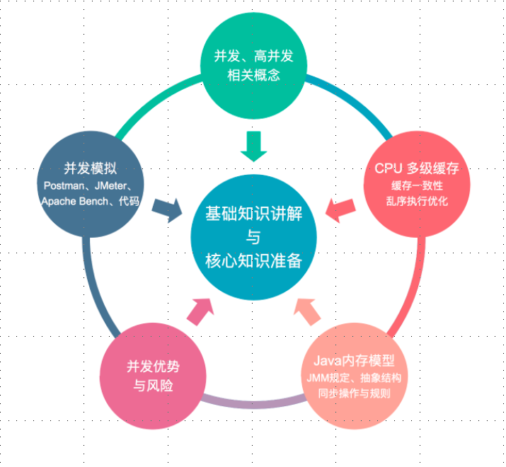
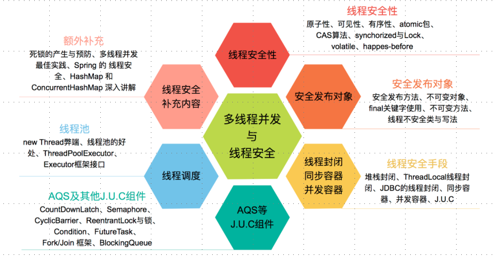
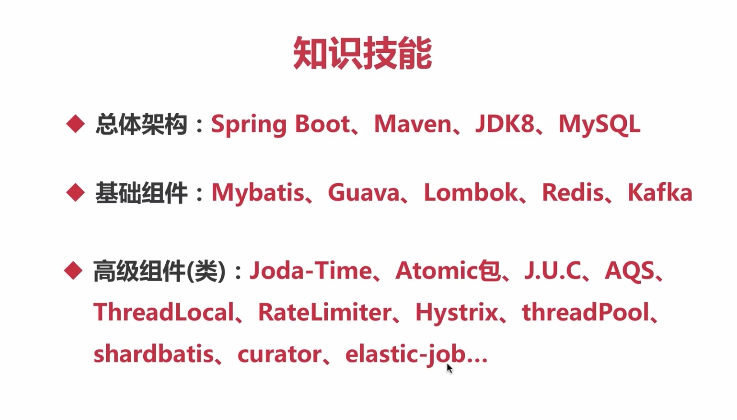

# Java并发编程

* **并发：** 同时拥有两个或多个线程，如果程序在单核处理器上运行，多个线程将交替地换入或换出内存，
这些线程是同时存在的，每个线程都处于执行过程中的某个状态，如果运行在多核处理器上，程序中
的每个线程都将分配到一个处理器核上，因此可以同时进行。  
（多个线程操作相同资源，保证线程安全，合理使用资源）

* **高并发：** 高并发是互联网分布式系统架构设计中必须考虑的因素之一，它通常是指，通过设计保证系统
能够同时并行处理很多请求 
（服务能同时处理很多请求，提高程序性能）  

* 基础知识讲解与核心知识准备：

* 并发及并发的线程安全处理：

* 高并发处理：

##项目准备
###基于springboot
###注解准备，用于标识学习中线程（不）安全，（不）推荐的类或写法
###并发模拟工具 
 postman  Apache Bench  JMeter  代码模拟
###代码模拟
CountDownLatch（计数器） Semaphore(信号量)  线程池

###线程安全
####原子性(com.wyw.concurrency.example.atomic)
 通过AtomicXXX实现，做自增操作时调用unsafe.getAndAddInt，进而调用compareAndSwapInt()实现，即CAS