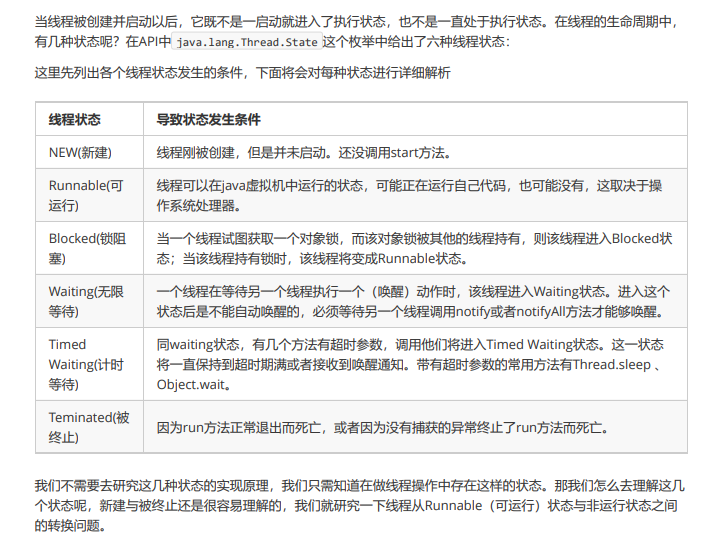
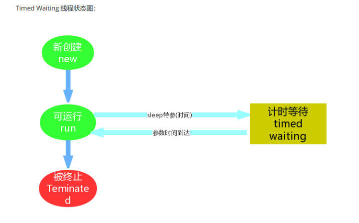
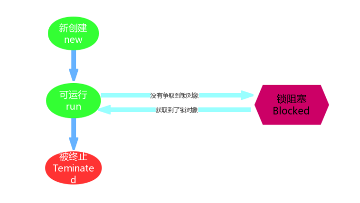
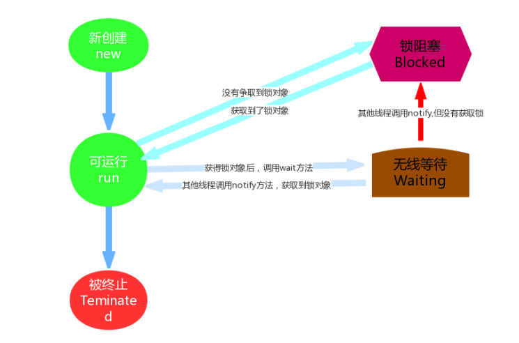
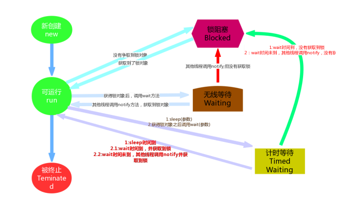

#  第一章 线程

我们在之前，学习的程序在没有跳转语句的前提下，都是由上至下依次执行，那现在想要设计一个程序，边打游戏边听歌，怎么设计？

要解决上述问题,咱们得使用多进程或者多线程来解决.

## 1.1 并发与并行

* **并发**：指两个或多个事件在**同一个时间段内**发生。
* **并行**：指两个或多个事件在**同一时刻**发生（同时发生）。

在操作系统中，安装了多个程序，并发指的是在一段时间内宏观上有多个程序同时运行，这在单 CPU 系统中，每一时刻只能有一道程序执行，即微观上这些程序是分时的交替运行，只不过是给人的感觉是同时运行，那是因为分时交替运行的时间是非常短的。

而在多个 CPU 系统中，则这些可以并发执行的程序便可以分配到多个处理器上（CPU），实现多任务并行执行，即利用每个处理器来处理一个可以并发执行的程序，这样多个程序便可以同时执行。目前电脑市场上说的多核 CPU，便是多核处理器，核 越多，并行处理的程序越多，能大大的提高电脑运行的效率。

> 注意：单核处理器的计算机肯定是不能并行的处理多个任务的，只能是多个任务在单个CPU上并发运行。同理,线程也是一样的，从宏观角度上理解线程是并行运行的，但是从微观角度上分析却是串行运行的，即一个线程一个线程的去运行，当系统只有一个CPU时，线程会以某种顺序执行多个线程，我们把这种情况称之为线程调度。

## 1.2 线程与进程

* **进程**：是指一个内存中运行的应用程序，每个进程都有一个独立的内存空间，一个应用程序可以同时运行多个进程；进程也是程序的一次执行过程，是系统运行程序的基本单位；系统运行一个程序即是一个进程从创建、运行到消亡的过程。

* **线程**：线程是进程中的一个执行单元，负责当前进程中程序的执行，一个进程中至少有一个线程。一个进程中是可以有多个线程的，这个应用程序也可以称之为多线程程序。 

  简而言之：一个程序运行后至少有一个进程，一个进程中可以包含多个线程 

  我们可以再电脑底部任务栏，右键----->打开任务管理器,可以查看当前任务的进程：

**进程**

**线程**

**线程调度:**

- 分时调度

  所有线程轮流使用 CPU 的使用权，平均分配每个线程占用 CPU 的时间。

- 抢占式调度

  优先让优先级高的线程使用 CPU，如果线程的优先级相同，那么会随机选择一个(线程随机性)，Java使用的为抢占式调度。

  - 设置线程的优先级

  
  -  抢占式调度详解

    大部分操作系统都支持多进程并发运行，现在的操作系统几乎都支持同时运行多个程序。比如：现在我们上课一边使用编辑器，一边使用录屏软件，同时还开着画图板，dos窗口等软件。此时，这些程序是在同时运行，”感觉这些软件好像在同一时刻运行着“。

    实际上，CPU(中央处理器)使用抢占式调度模式在多个线程间进行着高速的切换。对于CPU的一个核而言，某个时刻，只能执行一个线程，而 CPU的在多个线程间切换速度相对我们的感觉要快，看上去就是在同一时刻运行。
    其实，多线程程序并不能提高程序的运行速度，但能够提高程序运行效率，让CPU的使用率更高。

    

## 1.3 创建线程类

Java使用`java.lang.Thread`类代表**线程**，所有的线程对象都必须是Thread类或其子类的实例。每个线程的作用是完成一定的任务，实际上就是执行一段程序流即一段顺序执行的代码。Java使用线程执行体来代表这段程序流。Java中通过继承Thread类来**创建**并**启动多线程**的步骤如下：

1. 定义Thread类的子类，并重写该类的run()方法，该run()方法的方法体就代表了线程需要完成的任务,因此把run()方法称为线程执行体。
2. 创建Thread子类的实例，即创建了线程对象
3. 调用线程对象的start()方法来启动该线程

代码如下：

测试类：

~~~java
public class Demo01 {
	public static void main(String[] args) {
		//创建自定义线程对象
		MyThread mt = new MyThread("新的线程！");
		//开启新线程
		mt.start();
		//在主方法中执行for循环
		for (int i = 0; i < 10; i++) {
			System.out.println("main线程！"+i);
		}
	}
}
~~~

自定义线程类：

~~~java
public class MyThread extends Thread {
	//定义指定线程名称的构造方法
	public MyThread(String name) {
		//调用父类的String参数的构造方法，指定线程的名称
		super(name);
	}
	/**
	 * 重写run方法，完成该线程执行的逻辑
	 */
	@Override
	public void run() {
		for (int i = 0; i < 10; i++) {
			System.out.println(getName()+"：正在执行！"+i);
		}
	}
}
~~~

##1.4 实现Runnable接口
    如果一个类继承Thread，则不适合资源共享。但是如果实现了Runable接口的话，则很容易的实现资源共享。
*  总结：
   实现Runnable接口比继承Thread类所具有的优势：
   
    1. 适合多个相同的程序代码的线程去共享同一个资源。
    2. 可以避免java中的单继承的局限性。
    3. 增加程序的健壮性，实现解耦操作，代码可以被多个线程共享，代码和线程独立。
    4. 线程池只能放入实现Runable或Callable类线程，不能直接放入继承Thread的类。  
    
demo：
~~~java
public class MyRunnable implements Runnable {
    @Override
    public void run() {
        for (int i = 0; i < 20; i++) {
            System.out.println(Thread.currentThread().getName()+" "+i);
        }
    }
}
~~~

# 第二章 线程安全

以卖票为例，多个线程（窗口）同时执行，会出现多个窗口同时售卖同一张票，且售卖出不存在的票的情况

当我们使用多个线程访问同一资源的时候，且多个线程中对资源有写的操作，就容易出现线程安全问题。
要解决上述多线程并发访问一个资源的安全性问题:也就是解决重复票与不存在票问题，Java中提供了同步机制
(synchronized)来解决。

案例分析：
窗口1线程进入操作的时候，窗口2和窗口3线程只能在外等着，窗口1操作结束，窗口1和窗口2和窗口3才有机会进入代码
去执行。也就是说在某个线程修改共享资源的时候，其他线程不能修改该资源，等待修改完毕同步之后，才能去抢夺CPU
资源，完成对应的操作，保证了数据的同步性，解决了线程不安全的现象。

线程同步机制：  
1. 同步代码块。
2. 同步方法。
3. 锁机制  

## 2.1同步代码块
 **synchronized**关键字可以用于方法中的某个区块中，表示只对这个区块的资源实行互斥访问。
格式:
~~~
synchronized(同步锁){
    需要同步操作的代码
}
~~~
同步锁:
对象的同步锁只是一个概念,可以想象为在对象上标记了一个锁.
1. 锁对象 可以是任意类型。
2. 多个线程对象 要使用同一把锁。
* 注意:在任何时候,最多允许一个线程拥有同步锁,谁拿到锁就进入代码块,其他的线程只能在外等着
(BLOCKED)。

## 2.2同步方法
* **同步方法**:使用synchronized修饰的方法,就叫做同步方法,保证A线程执行该方法的时候,其他线程只能在方法外
等着。
格式：
~~~
    public synchronized void method(){
        可能会产生线程安全问题的代码
    }
~~~

同步锁是谁?
对于非static方法,同步锁就是this。
对于static方法,我们使用当前方法所在类的字节码对象(类名.class)。

## 2.3 Lock锁  
* **java.util.concurrent.locks.Lock** 机制提供了比synchronized代码块和synchronized方法更广泛的锁定操作,
同步代码块/同步方法具有的功能Lock都有,除此之外更强大,更体现面向对象。  
Lock锁也称同步锁，加锁与释放锁方法化了，如下：

    public void lock() :加同步锁。
    public void unlock() :释放同步锁。
    
# 第三章 线程状态  
* 线程状态

## 3.1  Timed Waiting（计时等待）
**Timed Waiting**在API中的描述为：一个正在限时等待另一个线程执行一个（唤醒）动作的线程处于这一状态
在我们写卖票的案例中，为了减少线程执行太快，现象不明显等问题，我们在run方法中添加了sleep语句，这样就
强制当前正在执行的线程休眠（暂停执行），以“减慢线程”。
其实当我们调用了sleep方法之后，当前执行的线程就进入到“休眠状态”，其实就是所谓的Timed Waiting(计时等
待)，案例：
实现一个计数器，计数到100，在每个数字之间暂停1秒，每隔10个数字输出一个字符串  
总结：
1. 进入 TIMED_WAITING 状态的一种常见情形是调用的 sleep 方法，单独的线程也可以调用，不一定非要有协
作关系。
2. 为了让其他线程有机会执行，可以将Thread.sleep()的调用放线程run()之内。这样才能保证该线程执行过程
中会睡眠
3. sleep与锁无关，线程睡眠到期自动苏醒，并返回到Runnable（可运行）状态。
* 小提示：sleep()中指定的时间是线程不会运行的最短时间。因此，sleep()方法不能保证该线程睡眠到期后就
开始立刻执行。  
Timed Waiting 线程状态图：

## 3.2 BLOCKED（锁阻塞）
Blocked 线程状态图：

## 3.3 Waiting（无限等待）
一个正在无限期等待另一个线程执行一个特别的（唤醒）动作的线程处于这一状态。
  
线程状态关系：
  

# 第四章 等待唤醒机制

## 4.1 线程间通信
**概念：** 多个线程在处理同一个资源，但是处理的动作（线程的任务）却不相同。

比如：线程A用来生成包子的，线程B用来吃包子的，包子可以理解为同一资源，线程A与线程B处理的动作，一个是生产，一个是消费，那么线程A与线程B之间就存在线程通信问题。

**为什么要处理线程间通信：**

多个线程并发执行时, 在默认情况下CPU是随机切换线程的，当我们需要多个线程来共同完成一件任务，并且我们希望他们有规律的执行, 那么多线程之间需要一些协调通信，以此来帮我们达到多线程共同操作一份数据。

**如何保证线程间通信有效利用资源：**

多个线程在处理同一个资源，并且任务不同时，需要线程通信来帮助解决线程之间对同一个变量的使用或操作。 就是多个线程在操作同一份数据时， 避免对同一共享变量的争夺。也就是我们需要通过一定的手段使各个线程能有效的利用资源。而这种手段即—— **等待唤醒机制。**

## 4.2 等待唤醒机制

**什么是等待唤醒机制**

这是多个线程间的一种**协作**机制。谈到线程我们经常想到的是线程间的**竞争（race）**，比如去争夺锁，但这并不是故事的全部，线程间也会有协作机制。就好比在公司里你和你的同事们，你们可能存在在晋升时的竞争，但更多时候你们更多是一起合作以完成某些任务。

就是在一个线程进行了规定操作后，就进入等待状态（**wait()**）， 等待其他线程执行完他们的指定代码过后 再将其唤醒（**notify()**）;在有多个线程进行等待时， 如果需要，可以使用 notifyAll()来唤醒所有的等待线程。

wait/notify 就是线程间的一种协作机制。

**等待唤醒中的方法**

等待唤醒机制就是用于解决线程间通信的问题的，使用到的3个方法的含义如下：

1. wait：线程不再活动，不再参与调度，进入 wait set 中，因此不会浪费 CPU 资源，也不会去竞争锁了，这时的线程状态即是 WAITING。它还要等着别的线程执行一个**特别的动作**，也即是“**通知（notify）**”在这个对象上等待的线程从wait set 中释放出来，重新进入到调度队列（ready queue）中
2. notify：则选取所通知对象的 wait set 中的一个线程释放；例如，餐馆有空位置后，等候就餐最久的顾客最先入座。
3. notifyAll：则释放所通知对象的 wait set 上的全部线程。

>注意：
>
>哪怕只通知了一个等待的线程，被通知线程也不能立即恢复执行，因为它当初中断的地方是在同步块内，而此刻它已经不持有锁，所以她需要再次尝试去获取锁（很可能面临其它线程的竞争），成功后才能在当初调用 wait 方法之后的地方恢复执行。
>
>总结如下：
>
>- 如果能获取锁，线程就从 WAITING 状态变成 RUNNABLE 状态；
>- 否则，从 wait set 出来，又进入 entry set，线程就从 WAITING 状态又变成 BLOCKED 状态

**调用wait和notify方法需要注意的细节**

1. wait方法与notify方法必须要由同一个锁对象调用。因为：对应的锁对象可以通过notify唤醒使用同一个锁对象调用的wait方法后的线程。
2. wait方法与notify方法是属于Object类的方法的。因为：锁对象可以是任意对象，而任意对象的所属类都是继承了Object类的。
3. wait方法与notify方法必须要在同步代码块或者是同步函数中使用。因为：必须要通过锁对象调用这2个方法。

## 4.3 生产者与消费者问题

等待唤醒机制其实就是经典的“生产者与消费者”的问题。

就拿生产包子消费包子来说等待唤醒机制如何有效利用资源：

~~~
包子铺线程生产包子，吃货线程消费包子。当包子没有时（包子状态为false），吃货线程等待，包子铺线程生产包子（即包子状态为true），
并通知吃货线程（解除吃货的等待状态）,因为已经有包子了，那么包子铺线程进入等待状态。接下来，吃货线程能否进一步执行则取决于锁的获取情况。
如果吃货获取到锁，那么就执行吃包子动作，包子吃完（包子状态为false），并通知包子铺线程（解除包子铺的等待状态）,吃货线程进入等待。
包子铺线程能否进一步执行则取决于锁的获取情况。
~~~

**代码演示：**

包子资源类：

~~~java
public class BaoZi {
     String  pier ;
     String  xianer ;
     boolean  flag = false ;//包子资源 是否存在  包子资源状态
}
~~~

吃货线程类：

~~~java
public class ChiHuo extends Thread{
    private BaoZi bz;

    public ChiHuo(String name,BaoZi bz){
        super(name);
        this.bz = bz;
    }
    @Override
    public void run() {
        while(true){
            synchronized (bz){
                if(bz.flag == false){//没包子
                    try {
                        bz.wait();
                    } catch (InterruptedException e) {
                        e.printStackTrace();
                    }
                }
                System.out.println("吃货正在吃"+bz.pier+bz.xianer+"包子");
                bz.flag = false;
                bz.notify();
            }
        }
    }
}
~~~

包子铺线程类：

~~~java
public class BaoZiPu extends Thread {

    private BaoZi bz;

    public BaoZiPu(String name,BaoZi bz){
        super(name);
        this.bz = bz;
    }

    @Override
    public void run() {
        int count = 0;
        //造包子
        while(true){
            //同步
            synchronized (bz){
                if(bz.flag == true){//包子资源  存在
                    try {

                        bz.wait();

                    } catch (InterruptedException e) {
                        e.printStackTrace();
                    }
                }

                // 没有包子  造包子
                System.out.println("包子铺开始做包子");
                if(count%2 == 0){
                    // 冰皮  五仁
                    bz.pier = "冰皮";
                    bz.xianer = "五仁";
                }else{
                    // 薄皮  牛肉大葱
                    bz.pier = "薄皮";
                    bz.xianer = "牛肉大葱";
                }
                count++;

                bz.flag=true;
                System.out.println("包子造好了："+bz.pier+bz.xianer);
                System.out.println("吃货来吃吧");
                //唤醒等待线程 （吃货）
                bz.notify();
            }
        }
    }
}
~~~

测试类：

~~~java
public class Demo {
    public static void main(String[] args) {
        //等待唤醒案例
        BaoZi bz = new BaoZi();

        ChiHuo ch = new ChiHuo("吃货",bz);
        BaoZiPu bzp = new BaoZiPu("包子铺",bz);

        ch.start();
        bzp.start();
    }
}
~~~

# 第五章 线程池

## 5.1 线程池思想概述

我们使用线程的时候就去创建一个线程，这样实现起来非常简便，但是就会有一个问题：

如果并发的线程数量很多，并且每个线程都是执行一个时间很短的任务就结束了，这样频繁创建线程就会大大降低系统的效率，因为频繁创建线程和销毁线程需要时间。

那么有没有一种办法使得线程可以复用，就是执行完一个任务，并不被销毁，而是可以继续执行其他的任务？

在Java中可以通过线程池来达到这样的效果。今天我们就来详细讲解一下Java的线程池。

## 5.2 线程池概念

* **线程池：** 其实就是一个容纳多个线程的容器，其中的线程可以反复使用，省去了频繁创建线程对象的操作，无需反复创建线程而消耗过多资源。

由于线程池中有很多操作都是与优化资源相关的，我们在这里就不多赘述。我们通过一张图来了解线程池的工作原理：

合理利用线程池能够带来三个好处：

1. 降低资源消耗。减少了创建和销毁线程的次数，每个工作线程都可以被重复利用，可执行多个任务。
2. 提高响应速度。当任务到达时，任务可以不需要的等到线程创建就能立即执行。
3. 提高线程的可管理性。可以根据系统的承受能力，调整线程池中工作线线程的数目，防止因为消耗过多的内存，而把服务器累趴下(每个线程需要大约1MB内存，线程开的越多，消耗的内存也就越大，最后死机)。

## 5.3 线程池的使用

Java里面线程池的顶级接口是`java.util.concurrent.Executor`，但是严格意义上讲`Executor`并不是一个线程池，而只是一个执行线程的工具。真正的线程池接口是`java.util.concurrent.ExecutorService`。

要配置一个线程池是比较复杂的，尤其是对于线程池的原理不是很清楚的情况下，很有可能配置的线程池不是较优的，因此在`java.util.concurrent.Executors`线程工厂类里面提供了一些静态工厂，生成一些常用的线程池。官方建议使用Executors工程类来创建线程池对象。

Executors类中有个创建线程池的方法如下：

* `public static ExecutorService newFixedThreadPool(int nThreads)`：返回线程池对象。(创建的是有界线程池,也就是池中的线程个数可以指定最大数量)

获取到了一个线程池ExecutorService 对象，那么怎么使用呢，在这里定义了一个使用线程池对象的方法如下：

* `public Future<?> submit(Runnable task)`:获取线程池中的某一个线程对象，并执行

  > Future接口：用来记录线程任务执行完毕后产生的结果。线程池创建与使用。

使用线程池中线程对象的步骤：

1. 创建线程池对象。
2. 创建Runnable接口子类对象。(task)
3. 提交Runnable接口子类对象。(take task)
4. 关闭线程池(一般不做)。

Runnable实现类代码：

~~~java
public class MyRunnable implements Runnable {
    @Override
    public void run() {
        System.out.println("我要一个教练");
        try {
            Thread.sleep(2000);
        } catch (InterruptedException e) {
            e.printStackTrace();
        }
        System.out.println("教练来了： " + Thread.currentThread().getName());
        System.out.println("教我游泳,交完后，教练回到了游泳池");
    }
}
~~~

线程池测试类：

~~~java
public class ThreadPoolDemo {
    public static void main(String[] args) {
        // 创建线程池对象
        ExecutorService service = Executors.newFixedThreadPool(2);//包含2个线程对象
        // 创建Runnable实例对象
        MyRunnable r = new MyRunnable();

        //自己创建线程对象的方式
        // Thread t = new Thread(r);
        // t.start(); ---> 调用MyRunnable中的run()

        // 从线程池中获取线程对象,然后调用MyRunnable中的run()
        service.submit(r);
        // 再获取个线程对象，调用MyRunnable中的run()
        service.submit(r);
        service.submit(r);
        // 注意：submit方法调用结束后，程序并不终止，是因为线程池控制了线程的关闭。
        // 将使用完的线程又归还到了线程池中
        // 关闭线程池
        //service.shutdown();
    }
}
~~~
